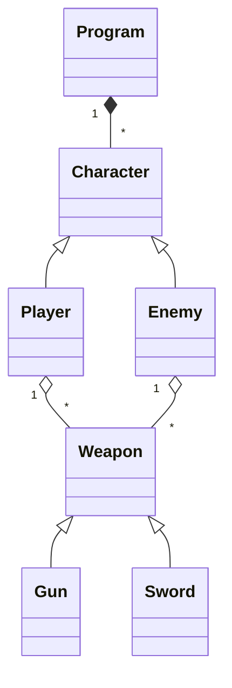

```mermaid
    classDiagram
        Program "1" *-- "*" Character
        Character <|-- Player
        Character <|-- Enemy
        Player "1" o-- "*" Weapon
        Enemy "1" o-- "*" Weapon
        Weapon <|-- Gun
        Weapon <|-- Sword
```